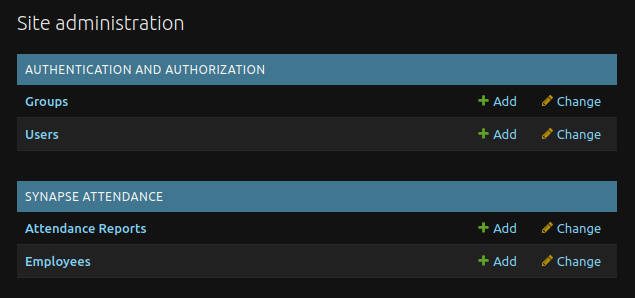
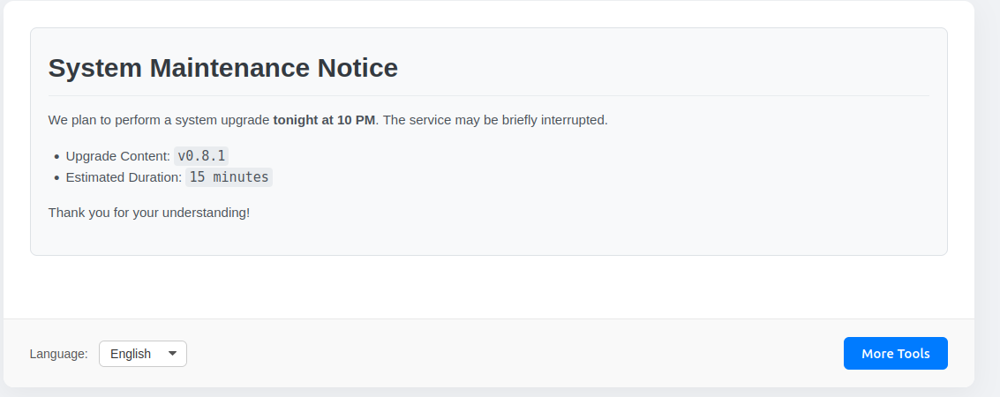

<!--
Copyright (c) 2025-present, PotterWhite (themanuknowwhom@outlook.com).
All rights reserved.

This source code is licensed under the MIT license found in the
LICENSE file in the root directory of this source tree.

T-HEAD-GR-V0.8.0-20250910 (English README for SynapseERP)
-->

<div align="center">
  <h2>SynapseERP</h2>
  <p><i>A modular Django framework for data analysis tools</i></p>
</div>

<p align="center">
  
</p>

<p align="center">
  <a href="https://github.com/potterwhite/SynapseERP/releases"></a>
  <a href="https://github.com/potterwhite/SynapseERP/blob/main/LICENSE"></a>
</p>

<p align="center">
  <strong>English</strong> | <a href="./README.zh.md">简体中文</a>
</p>

<p align="center">
  <a href="#1-quick-start">🚀 Quick Start</a> •
  <a href="#2-production-deployment">⚙️ Production Deployment</a> •
  <a href="#3-appendix">📚 Appendix</a>
</p>

---

# 1. Quick Start

This guide is designed to help you set up and run a local development environment as quickly as possible.

**Prerequisites:**
*   Python 3.8+
*   Git (for cloning the repository)

### Step 1.1: Get the Code

Clone the repository and enter the project directory:
```bash
git clone git@github.com:potterwhite/SynapseERP.git
cd SynapseERP
```

### Step 1.2: Prepare the Environment

This project uses a fully automated preparation script.

1.  **Give the script execution permissions:**
    ```bash
    chmod +x run.sh
    ```

2.  **Run the script:**
    ```bash
    ./run.sh prepare
    ```
    This single command handles everything: it will create a Python virtual environment, install all dependencies, generate a secure `.env` configuration file, and initialize the database.

### Step 1.3: Run the Application

After the preparation is complete:

1.  **Create an administrator user:**
    ```bash
    ./run.sh superuser
    ```
    Follow the prompts to create your admin account.

2.  **Run the development server:**
    ```bash
    ./run.sh run
    ```
    You can now access the application at **http://127.0.0.1:8000** and the admin panel at **http://127.0.0.1:8000/admin/**.

---

# 2. Production Deployment

The `./run.sh run` command is **for development use only**. For a real production environment, this project provides a fully automated deployment command that will run your application using Gunicorn and Nginx.

### Execute Automated Deployment

On your production server, run the following command with `sudo` privileges:

```bash
sudo ./run.sh deploy
```
This command is **interactive** and **fully automated**. It will guide you through all the necessary steps:

1.  It will **check** your system environment (e.g., if Nginx is installed) and provide guidance.
2.  It will **ask** for your server's domain (or IP) and the username that will run the service.
3.  It will **automatically handle** all configuration, service installation, and startup.
4.  Finally, it will automatically configure your `.env` file with the necessary settings for a production environment.

After the deployment is complete, the script will display the final access address for your application.

---

# 3. Appendix

### 3.1 Attendance Analyzer Rules

The Attendance Analyzer is controlled by a TOML rules file. The system uses a three-tier priority strategy to decide which rules file to load:

**`Remote URL > Local Custom File > Default File`**

This provides maximum flexibility.

#### Method A (Recommended for Production): Using a Remote URL
This is the ideal method when you need to provide users with a specific set of rules without modifying the code.

*   **Set a remote rules URL:**
    ```bash
    # Replace this URL with your own Gist or raw file URL
    ./run.sh set-rule "https://your-url/path/to/rules.toml"
    ```
    This command will securely save the URL to your local `.env` file.

*   **Clear the remote rules URL** (to revert to using local or default rules):
    ```bash
    ./run.sh set-rule
    ```

#### Method B (For Local Development): Using a Local File
This is very useful for offline development or quickly testing rule changes.

1.  Create a file named `local_rules.toml` in the `src/synapse_attendance/engine/rules/` directory.
2.  You can copy the contents of `default_rules.toml` as a starting point.

If no remote URL is set in the `.env` file, the application will automatically detect and use this file. This file is ignored by Git.

#### Method C (Default): Out-of-the-Box Rules
If neither a remote URL nor a local file is found, the system will fall back to using `src/synapse_attendance/engine/rules/default_rules.toml`.

### 3.2 Developer Commands

These commands are intended for contributors or developers who **wish to modify the application's source code or database structure**. Regular users **do not need** to use these commands in daily operation.

*   **`./run.sh dev:migrate`**
    *   **Purpose:** Creates and applies database migrations.
    *   **When to use:** Use this command after you have **modified a `models.py` file** to update the database schema.

*   **`./run.sh dev:makemessages`**
    *   **Purpose:** Scans all source code and templates for translatable strings and updates the `.po` translation source files.
    *   **When to use:** Use this after you have **added or changed user-facing text that needs to be translated**.

*   **`./run.sh dev:compilemessages`**
    *   **Purpose:** Compiles the text-based `.po` files into binary `.mo` files that Django uses.
    *   **When to use:** Use this after running `dev:makemessages` or after pulling translation updates from the repository.

*   **`./run.sh dev:test`**
    *   **Purpose:** Runs the project's automated test suite.
    *   **When to use:** Use frequently during **the development of new features** to ensure your changes have not broken existing functionality.

### 3.3 Publishing Your First Notification

The Dashboard page features a notification panel that can display important information to all users. The following will guide you on how to publish your first notification through the admin panel.

#### Step 3.3.1: Access the Admin Panel

1.  Ensure your development server is running (`./run.sh run`).
2.  Open the admin login page in your browser: **http://127.0.0.1:8000/admin/**
3.  Log in with the administrator account you created in `Step 1.3` using the `./run.sh superuser` command.

#### Step 3.3.2: Create a New Notification

1.  After logging in, you will see the "Site administration" page. Under the **SYNAPSE DASHBOARD** section, find and click the "Add" link next to **Notifications**.

    <p align="center">
      
    </p>

2.  You will be taken to the "Add Notification" page. There is only one field you need to fill in: **Content**.

3.  This input field supports **Markdown syntax**. You can enter some simple text or try some Markdown formatting, for example:
    ```markdown
    # System Maintenance Notice

    We plan to perform a system upgrade **tonight at 10 PM**. The service may be briefly interrupted.

    *   Upgrade Content: `v0.8.1`
    *   Estimated Duration: `15 minutes`

    Thank you for your understanding!
    ```

4.  After filling it out, click the **SAVE** button in the bottom right corner of the page.

#### Step 3.3.3: Check the Result

Now, return to the application's main page at **http://127.0.0.1:8000**. You will see that the notification you just published is displayed at the top of the page in a formatted style, like this:

<p align="center">
  
</p>

The system will always automatically display the most **recently updated** notification. You can return to the admin panel at any time to edit old notifications or add new ones, and the content on the main page will update automatically.