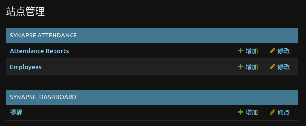
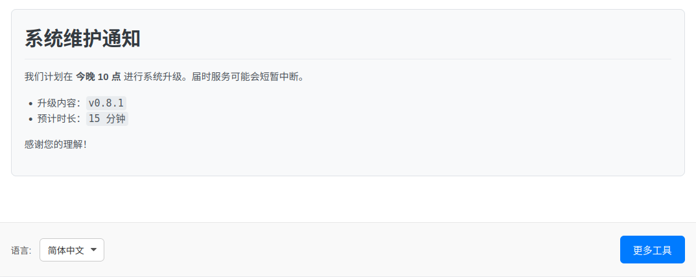

<!--
Copyright (c) 2025-present, PotterWhite (themanuknowwhom@outlook.com).
All rights reserved.

This source code is licensed under the MIT license found in the
LICENSE file in the root directory of this source tree.

T-HEAD-GR-V0.8.0-20250910 (Chinese README for SynapseERP)
-->

<div align="center">
  <h1>SynapseERP</h1>
  <p><i>一个用于数据分析工具的模块化 Django 框架</i></p>
</div>

<p align="center">
  
</p>

<p align="center">
  <a href="https://github.com/potterwhite/SynapseERP/releases"></a>
  <a href="#"></a>
  <a href="#"></a>
  <a href="https://github.com/potterwhite/SynapseERP/blob/main/LICENSE"></a>
</p>

<p align="center">
  <a href="../README.md">English</a> | <strong>简体中文</strong>
</p>

<p align="center">
  <a href="#1-快速开始">🚀 快速开始</a> •
  <a href="#2-正式部署">⚙️ 正式部署</a> •
  <a href="#3-附录">📚 附录</a>
</p>

---

# 1. 快速开始

本指南旨在帮助你以最快的速度搭建并运行一个本地开发环境。

**先决条件:**
*   Python 3.8+
*   Git (用于克隆仓库)

### 第 1.1 步：获取代码

克隆仓库并进入项目目录：
```bash
git clone git@github.com:potterwhite/SynapseERP.git
cd SynapseERP
```

### 第 1.2 步：准备环境

本项目使用一个完全自动化的准备脚本。

1.  **为脚本赋予执行权限:**
    ```bash
    chmod +x synapse
    ```

2.  **运行脚本:**
    ```bash
    ./synapse prepare
    ```
    这一个命令会处理所有事情：它会创建一个 Python 虚拟环境，安装所有依赖，生成一个安全的 `.env` 配置文件，并初始化数据库。

### 第 1.3 步：运行应用

在准备工作完成后：

1.  **创建一个管理员用户:**
    ```bash
    ./synapse superuser
    ```
    根据提示创建你的管理员账户。

2.  **运行开发服务器:**
    ```bash
    ./synapse run
    ```
    现在你可以通过 **http://127.0.0.1:8000** 访问应用程序，并通过 **http://127.0.0.1:8000/admin/** 访问后台管理面板。

---

# 2. 正式部署

`./synapse run` 命令**仅供开发使用**。对于真实的生产环境，本项目提供了一个全自动的部署命令，它将使用 Gunicorn 和 Nginx 来运行你的应用。

### 执行自动化部署

在你的生产服务器上，以 `sudo` 权限运行以下命令：

```bash
sudo ./synapse deploy
```
这个命令是**交互式的**并且是**全自动的**。它会引导你完成所有必要的步骤：

1.  它会**检查**你的系统环境（例如 Nginx 是否已安装）并给出指引。
2.  它会**询问**你服务器的域名（或IP）和将要运行服务的用户名。
3.  它会**自动处理**所有配置、服务安装和启动。
4.  最后，它会自动为你的 `.env` 文件配置好生产环境所需的设置。

部署完成后，脚本会显示你的应用最终的访问地址。

---

# 3. 附录

### 3.1 考勤分析器规则

考勤分析器由一个 TOML 规则文件控制。系统使用一个三层优先级策略来决定加载哪个规则文件：

**`远程 URL > 本地自定义文件 > 默认文件`**

这提供了最大的灵活性。

#### 方法 A (生产环境推荐)：使用远程 URL
当你需要为用户提供一个特定的规则集而无需修改代码时，这是最理想的方法。

*   **设置一个远程规则 URL:**
    ```bash
    # 将此 URL 替换为你自己的 Gist 或原始文件 URL
    ./synapse set-rule "https://your-url/path/to/rules.toml"
    ```
    此命令会安全地将 URL 保存到你本地的 `.env` 文件中。

*   **清除远程规则 URL** (以恢复使用本地或默认规则):
    ```bash
    ./synapse set-rule
    ```

#### 方法 B (本地开发使用)：使用本地文件
这对于离线开发或快速测试规则变更非常有用。

1.  在 `src/synapse_attendance/engine/rules/` 目录下创建一个名为 `local_rules.toml` 的文件。
2.  你可以将 `default_rules.toml` 的内容复制进去作为起点。

如果 `.env` 文件中没有设置远程 URL，应用将自动检测并使用此文件。此文件被 Git 忽略。

#### 方法 C (默认)：开箱即用的规则
如果既没有找到远程 URL，也没有找到本地文件，系统将回退使用 `src/synapse_attendance/engine/rules/default_rules.toml`。

### 3.2 开发者命令

这些命令是为**希望修改应用程序源代码或数据库结构**的贡献者或开发者准备的。普通用户在日常使用中**无需**接触这些命令。

*   **`./synapse dev:migrate`**
    *   **作用:** 创建并应用数据库迁移。
    *   **使用时机:** 在你**修改了 `models.py` 文件之后**，用此命令来更新数据库的结构。

*   **`./synapse dev:makemessages`**
    *   **作用:** 扫描所有源代码和模板，查找可翻译的字符串，并更新 `.po` 翻译源文件。
    *   **使用时机:** 在你**添加或更改了需要被翻译的用户界面文本之后**使用。

*   **`./synapse dev:compilemessages`**
    *   **作用:** 将文本格式的 `.po` 文件编译成 Django 使用的二进制 `.mo` 文件。
    *   **使用时机:** 在运行 `dev:makemessages` 或从代码库拉取了翻译更新之后使用。

*   **`./synapse dev:test`**
    *   **作用:** 运行项目的自动化测试套件。
    *   **使用时机:** 在**开发新功能的过程中**频繁使用，以确保你的更改没有破坏现有功能。

### 3.3 发布第一条通知

Dashboard（仪表盘）页面有一个通知面板，可以向所有用户展示重要的信息。下面将引导你如何通过后台管理面板发布你的第一条通知。

#### 第 3.3.1 步：访问后台管理面板

1.  确保你的开发服务器正在运行 (`./synapse run`)。
2.  在浏览器中打开后台登录页面： **http://127.0.0.1:8000/admin/**
3.  使用你在 `1.3 步` 中通过 `./synapse superuser` 命令创建的管理员账户登录。

#### 第 3.3.2 步：创建一条新通知

1.  登录后，你会看到“站点管理”页面。在 **SYNAPSE DASHBOARD** 板块下，找到并点击 **提醒 (Notifications)** 旁边的“增加 (Add)”链接。

    <p align="center">
      
    </p>

2.  你将进入“增加 提醒 (Add Notification)”页面。这里只有一个需要你填写的字段：**内容 (Content)**。

3.  这个输入框支持 **Markdown 语法**。你可以输入一些简单的文本，或者尝试一些 Markdown 格式，例如：
    ```markdown
    # 系统维护通知

    我们计划在 **今晚 10 点** 进行系统升级。届时服务可能会短暂中断。

    *   升级内容：`v0.8.1`
    *   预计时长：`15 分钟`

    感谢您的理解！
    ```

4.  填写完毕后，点击页面右下角的 **保存 (SAVE)** 按钮。

#### 第 3.3.3 步：查看结果

现在，返回应用的主页 **http://127.0.0.1:8000**。你会看到你刚刚发布的通知已经以格式化的样式显示在了页面的顶部，就像这样：

<p align="center">
  
</p>

系统总是会自动显示**最新更新过**的那条通知。你可以随时回到后台编辑旧的通知或添加新的通知，主页上的内容会自动同步更新。

---
